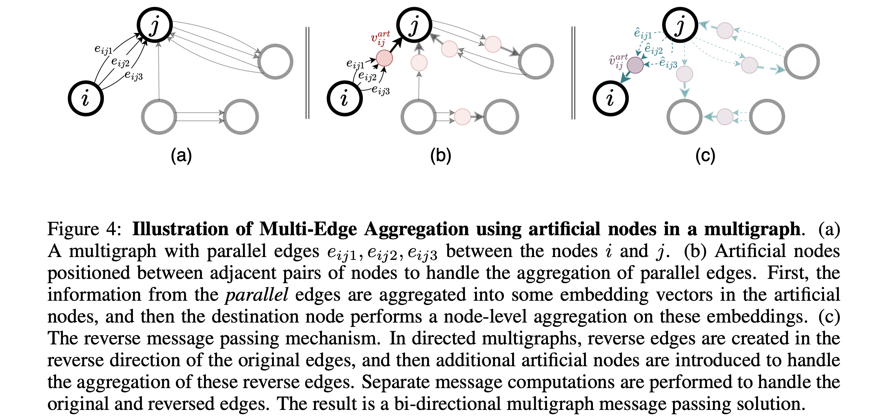

# Mega-GNN

This is the official implemetation of "Multigraph Message Passing with Bi-Directional Multi-Edge Aggregations".

<p align="center">
  
</p>

**Paper**: [arXiv](https://arxiv.org/abs/2412.00241)
## Abstract 
Graph Neural Networks (GNNs) have seen significant advances in recent years, yet their application to multigraphs, where parallel edges exist between the same pair of nodes, remains under-explored. Standard GNNs, designed for simple graphs, compute node representations by combining all connected edges at once, without distinguishing between edges from different neighbors. There are some GNN architectures proposed specifically for multigraphs, yet these architectures perform only node-level aggregation in their message passing layers, which limits their expressive power. Furthermore, these approaches either lack permutation equivariance when a strict total edge ordering is absent, or fail to preserve the topological structure of the multigraph. To address all these shortcomings, we propose MEGA-GNN, a unified framework for message passing on multigraphs that can effectively perform diverse graph learning tasks. Our approach introduces a two-stage aggregation process in the message passing layers: first, parallel edges are aggregated, followed by a node-level aggregation of messages from distinct neighbors. We show that MEGA-GNN is not only permutation equivariant but also universal given a strict total ordering on the edges. Experiments show that MEGA-GNN significantly outperforms state-of-the-art solutions by up to 13\% on Anti-Money Laundering datasets and is on par with their accuracy on real-world phishing classification datasets in terms of minority class F1 score.


## Setup

- Create a new Conda environment, and activate.
```bash
conda env create -f env.yml
conda activate megagnn

```
- Install Pytorch and Pytorch Geometric
```bash
conda install pytorch==2.2.2 torchvision==0.17.2 torchaudio==2.2.2 pytorch-cuda=11.8 -c pytorch -c nvidia
conda install pyg -c pyg
pip install -r requirements.txt
```
- Lastly, install genagg
```bash
cd genagg 
pip install -e .
```


## Data

The data needed for the experiments can be found on [Kaggle](https://www.kaggle.com/datasets/ealtman2019 ibm-transactions-for-anti-money-laundering-aml/data). To use this data with the provided training scripts, you first need to perform a pre-processing step for the downloaded transaction files (e.g. `HI-Small_Trans.csv`):
  ```
  python format_kaggle_files.py /path/to/kaggle-files/HI-Small_Trans.csv
  ```
  - Make sure to change the filepaths in the `data_config.json` file. The `aml_data` path should be changed to wherever you stored the `formatted_transactions.csv` file generated by the pre-processing step.

The data for node classification experiments can be found on [ETH-Kaggle](https://drive.google.com/drive/folders/1d-RATjhyStzSWqU8OLbB74ywa00ztAIf?usp=share_link).


## Run the Code
To use different datasets, change the dataset name and the downstream task, and run the model with the additional parameters provided in utils.py.
- MEGA-GIN
```bash
python main.py --data Small_HI --model gin --emlps --reverse_mp --ego --flatten_edges --edge_agg_type gin --n_epochs 80 --save_model --task edge_class
```
- MEGA-PNA
```bash
python main.py --data Small_HI --model pna --emlps --reverse_mp --ego --flatten_edges --edge_agg_type pna --n_epochs 80 --save_model --task edge_class
```

## Citation
If you use our work in your research, please cite our paper:

    @misc{bilgi2024multigraphmessagepassingbidirectional,
          title={Multigraph Message Passing with Bi-Directional Multi-Edge Aggregations}, 
          author={H. Çağrı Bilgi and Lydia Y. Chen and Kubilay Atasu},
          year={2024},
          eprint={2412.00241},
          archivePrefix={arXiv},
          primaryClass={cs.LG},
          url={https://arxiv.org/abs/2412.00241}, 
    }

### Acknowledgements

We used the codebase of [Multi-GNN](https://github.com/IBM/Multi-GNN) and [GenAgg](https://github.com/Acciorocketships/generalised-aggregation) and thank their authors for their excellent work.
